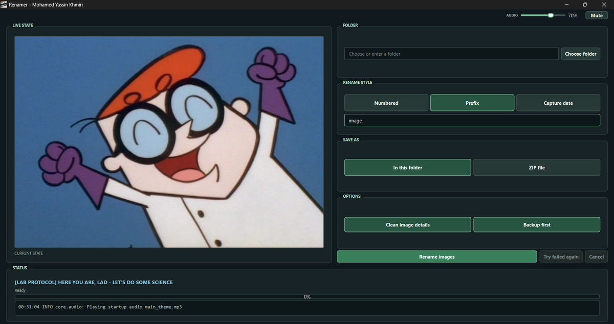
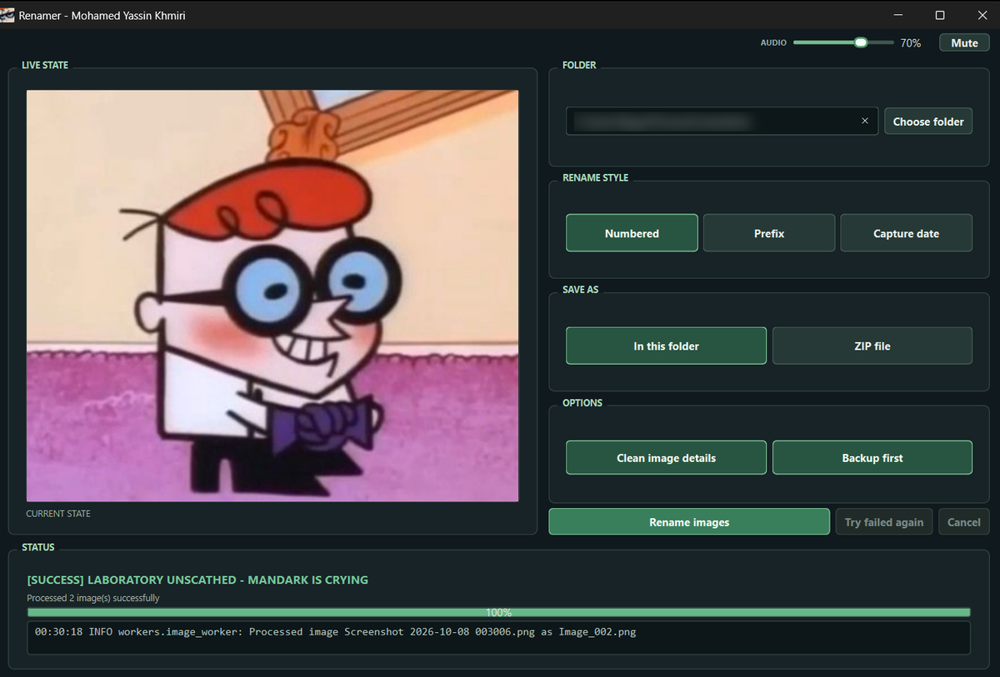
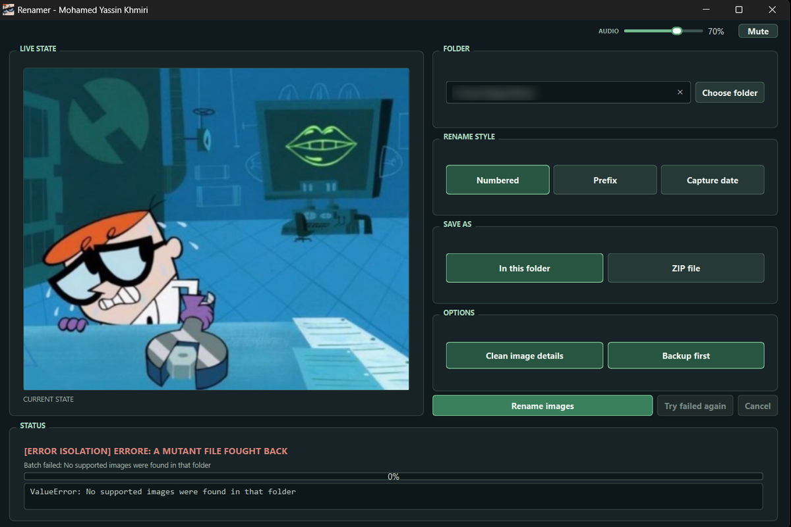
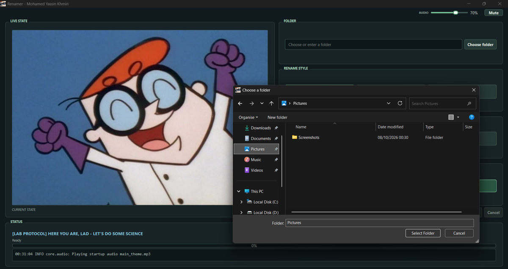

<h1 align="center">Renamer</h1>


<p align="center">
  
  
  
  
</p>

> **Note:** Ladies and mental gen, it might not be sounds pro but this was actually one of my very very first projects years ago! I was about to delete it, but then thought, why not publish it for fun?

> **Just if someone really care (I doubt that LOL):** This project will not get any more updates or further development. I am completely done coding this one  **Yet** Hope y'all like it.

---

## What's the thing

Renamer is a PySide6 app that renames your images in bulk, shows you live progress, and tells you if something went wrong:

* **Rename only:** Updates original files directly. Quick and simple.
* **Rename + clear metadata:** Removes hidden data while updating files. Sneaky info, be gone.
* **Rename + ZIP archive:** Saves renamed copies into a ZIP. Originals stay safe and sound.
* **Rename + clear metadata + ZIP archive:** Cleans and copies files straight into a ZIP. The full combo meal.

---

## Take a peek inside the lab

<p align="center">
  
</p>
<p align="center"><em>The main window: pick a folder, choose a rename style, choose where to save, then smash that <b>Rename images</b> button.</em></p>

<p align="center">
  
  
</p>
<p align="center"><em>Live status: a finished batch on the left (yay), and a clear error on the right when a folder has no supported images (oops, wrong folder).</em></p>

<p align="center">
  
</p>
<p align="center"><em>Choose a folder with the standard Windows picker.</em></p>

### Wait, why Dexter's Laboratory?

> you may be wondering why I used Dexter's Laboratory as the main theme. Well, I was just looking for inspo on Pinterest for a Renamer icon and randomly saw Dexter et VOILA!.
>
> **I know I know none will ever care but just in case:** *Dexter's Laboratory belongs to its respective owners. This is a fan-made, non-commercial project and is not affiliated with or endorsed by them.*

---

## Get Renamer

Two ways to join the fun:

1. **Download the ready-to-use app (the lazy way, no shame):** Open this repository's **[Releases](../../releases)** page, download `Renamer-Setup.exe`, and run it. The Windows setup wizard installs Renamer, adds a desktop shortcut, and registers a standard Windows uninstaller. No Python, PowerShell, or developer tools needed.
2. **Run from source (the curious way):** Clone or download this repository, install Python 3.10 or newer, and follow the source setup below. This is the option if you'd like to inspect the code and see what's cooking.

The setup installer supports **Windows 10 and Windows 11 on standard x64 PCs**.

### Run from source

From the project folder, install the runtime dependencies and fire it up:

```text
python -m pip install -r requirements.txt
python main.py
```

---

## What it does

- **Batch renaming:** Choose numbered names such as `Image_001.jpg`, a custom prefix such as `Holiday_001.jpg`, or capture-date names based on available EXIF data with a file-timestamp fallback. Name them however you like.
- **In-place or ZIP output:** Rename the files in their current folder, or create renamed copies in a ZIP while leaving the originals untouched.
- **Backups and rollback:** In-place jobs make a verified backup before changing files. The persistent backup is on by default. If you switch it off, Renamer still keeps a temporary rollback copy until the job succeeds. Cancelling restores the original files. Basically, you can't break stuff (we tried).
- **Collision protection:** Renamer adds a numeric suffix rather than overwriting an unrelated file. No files get bullied here.
- **Failure recovery:** Individual in-place file failures are logged without stopping the rest of the batch. **Try failed again** retries failed files. One bad apple won't ruin the bunch.
- **Metadata cleanup:** Lossless cleanup is implemented for JPEG and PNG. Other supported formats are validated but left unchanged.
- **Progress and status:** Follow the current state, progress bar, recent-event log, and state artwork. Hover over controls for helpful tips.
- **Optional audio:** Background music, WAV state cues, and generated short tones are supported, but audio is not required to use Renamer. Mute it, no hard feelings.

Renamer scans regular, non-symlink image files directly inside the selected folder; it does not search subfolders. It preserves file formats and does not convert images.

---

## Supported image formats

Renamer recognizes these filename extensions:

`.jpg`, `.jpeg`, `.png`, `.webp`, `.bmp`, `.tif`, `.tiff`, and `.gif`

An extension makes a file a scan candidate; it does not guarantee that its contents are valid image data. (A file named `cat.jpg` that's secretly a text file is still not a cat.)

### What metadata cleanup actually changes

- **JPEG:** Removes supported metadata segments and comments by filtering the encoded file stream. Compressed image data is copied as-is; ICC profiles and Adobe color-interpretation markers are preserved.
- **PNG:** Removes selected metadata chunks with chunk lengths and checksums validated. Image data and selected rendering, color, transparency, and animation chunks are retained.
- **WebP, BMP, TIFF, and GIF:** Validated when cleanup is requested, then left byte-for-byte unchanged. Renamer does not strip metadata from these formats. This avoids changing image quality, palettes, animation, or multipage content through re-encoding.

When cleanup is turned off for an in-place rename, files are copied and renamed without being decoded. ZIP mode requests cleanup automatically: JPEG and PNG may be cleaned, while the other supported formats stay unchanged.

---

## Project layout

Here's the map of the lab, in case you get lost:

```text
Renamer/
├── main.py                 # Application startup and rotating log setup
├── core/
│   ├── audio.py            # Optional music and sound cues
│   ├── backup_manager.py   # Verified backups and rollback
│   ├── metadata.py         # JPEG/PNG metadata filtering
│   └── renamer.py          # Filename planning and collision handling
├── workers/
│   └── image_worker.py     # Background processing and ZIP export
├── ui/
│   └── main_window.py      # PySide6 desktop interface
├── assets/
│   ├── audio/              # Optional music and sound cues
│   ├── icon.ico
│   └── *.jpg               # State artwork
├── docs/
│   └── screenshots/        # Images used in this README
├── installer/
│   └── Renamer.iss         # Windows setup and uninstaller definition
└── requirements.txt        # Runtime dependencies for source users
```

---

## Audio and logs

If `assets/audio/main_theme.mp3` is present, it loops while Renamer is open. Optional `ready.wav`, `working.wav`, `caution.wav`, `error.wav`, and `success.wav` files can provide state cues; if a cue is missing, Renamer can generate a short tone. Audio-device or playback problems are logged and do not stop image processing, so the show goes on.

Rotating logs are stored under `RENAMER_logs` in Qt's application-data folder. If Qt does not provide a data location, Renamer falls back to `~/RENAMER/RENAMER_logs`.

---

## License

Renamer is released under the MIT License. See [LICENSE](LICENSE) and [COPYRIGHT.md](COPYRIGHT.md) for the full notices.

Copyright © 2026 Mohamed Yassin Khmiri
